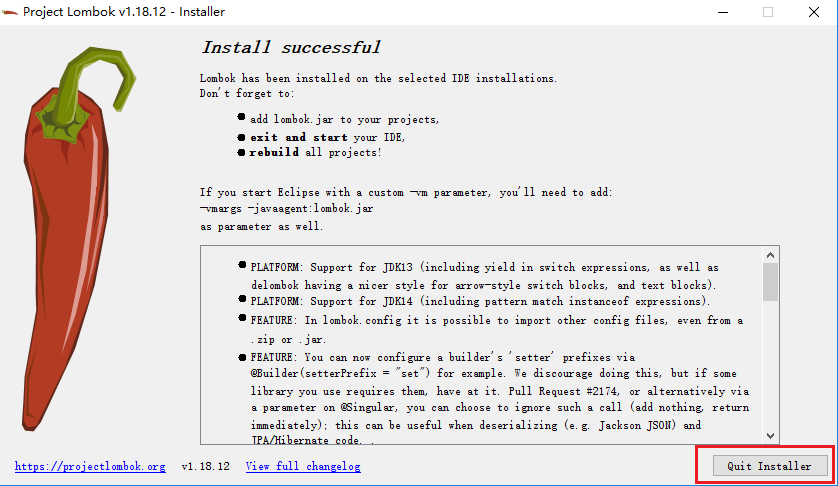

### 下载

**下载lombok.jar（一定要最新版）**

下载地址：https://projectlombok.org/download

<!--more-->

### 安装

1. **复制lombok.jar到eclipse.ini所在目录**

2. **安装lombok.jar**：shift+右键唤出命令窗口，运行**java -jar lombok.jar**  或者 直接双击lombok.jar（后者操作更简单）

   

3. 选择 eclipse.exe：
   

4. 确认 eclipse.exe：

5. 快速安装：
   

6. 操作完成后发现eclipse.ini多了一行配置：
   

### **安装成功后操作** 

重启eclipse并刷新项目，之前报错的set() get()等方法不再报错。

### **注意事项**

lombok.jar一定要从官网下载最新，否则安装后get() set()等方法仍会报错。