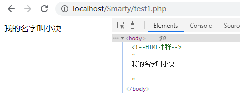

### 介绍

Smarty是PHP的一个引擎模板，可以更好的进行逻辑与显示的分离，即我们常说的MVC，这个引擎的作用就是将C分离出来。

### 安装

在网上下载Smarty包直接将其解压，我们需要的仅仅是里面的libs文件夹。

Libs文件里面都是库文件，我们不应该修改里面的任何内容。

解压完毕后就直接将libs文件夹放入到我们需要使用的网站根目录。


### 使用

首先打开Smarty.class.php文件看看里面的一些代码：

```php
    protected $template_dir = array('./templates/');
    protected $config_dir = array('./configs/');
    protected $compile_dir = './templates_c/';
    protected $cache_dir = './cache/';
```

Smarty的构造器：

- templates：默认存放模板文件夹
- templates_c：默认存放混编文件的文件夹
- cache：存放缓存
- configs：存放配置文件

默认左右边界符：

```php
    public $left_delimiter = "{";
    public $right_delimiter = "}";
```

### 简单使用

从上文了解到Smarty需要一些文件夹用来分别存放不同类别的文件。有templates、templates_c、cache、configs等文件夹。这是默认文件夹名称，你可以根据你的喜好对它们进行更改。

下面是我建立的文件夹：


简单实例：

1. 先在templates文件夹下准备自己需要的模板文件。test1.html

   ```
   <!DOCTYPE html>
   <html>
   <head>
       <meta charset="utf-8">
       <title>smarty test1</title>
   </head>
   <body>
   我的名字叫{$name}
   </body>
   </html>
   ```

2. 在根目录下建立访问的逻辑文件。test1.php

   ```
   <?php
   require './libs/Smarty.class.php';
   $smarty=new Smarty();
   $name='小决';
   $smarty->assign( 'name' , $name );
   $smarty->display('./test1.html');
   ```

3. 访问test1.php结果为：

   

4. 当访问完后将会在templates_c中生成一个相应的混编文件。

### 常用的语法

#### 普通变量的声明与使用

一共有两种声明变量的方法。

1. 即$smarty->assign('name','值');
2. 第二种：在模板文件中声明（html中），即{assignvar='name'value='值'}

使用：{$name}

注意：也可以定义与使用数组。假若上面定义的name为一个一维数组，使用时即：{$name[2]}、{$name['aa']}={$name.aa}等等使用方式。

#### 注释

```
{*这里面是注释内容*}
```

Smarty的注释是不会在最终页面输出显示的，即：若在html里则效果像 `<!--注释-->` 一样，不过也有一定的区别，Smarty的注释在浏览器里查看源代码也是不显示的，而html的注释是显示的。

代码：

```html
<body>
<!--HTML注释-->
{* 这里面是注释内容 *}
我的名字叫{$name}
</body>
```

结果：



#### 数组

Smarty对数组的使用：数组[下标]、数组.下标

#### 对象

对象的声明和变量一样，通过assign来声明使用采用->来调用对象的属性。

1. test2.php

   ```php
   <?php
   require './libs/Smarty.class.php';
   class Person{
   	public $name="小决";
   	public $sex="男";
   	public $age='18';
   }
   $smarty=new Smarty();
   $test=new Person();
   $smarty->assign( 'test' , $test );
   $smarty->display('./test2.html');
   ```

2. test2.html

   ```html
   <!DOCTYPE html>
   <html>
   <head>
       <meta charset="utf-8">
       <title>smarty test2</title>
   </head>
   <body>
   名字：{$test->name}</br>
   性别：{$test->sex}</br>
   年龄：{$test->age}</br>
   {$smarty.now}
   <hr/>
   </body>
   </html>
   ```

3. 结果：

   

