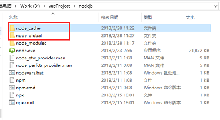
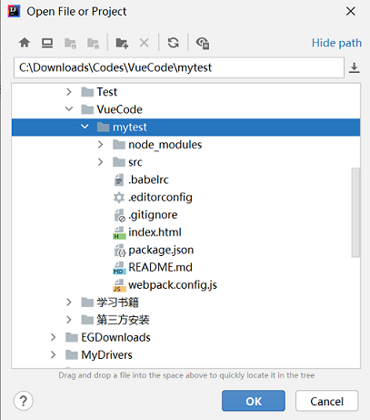

### 关于 Vue

VueJS是一个开源的渐进式JavaScript框架，用于开发交互式Web界面。

它是用于简化Web开发的着名框架之一，VueJS专注于视图层。它可以很容易地集成到大型项目前端开发没有任何问题。

- Vue 中文网：https://cn.vuejs.org/

<!--more-->

### 安装node.js

#### 安装

下载地址：https://nodejs.org/en/download/

安装完成：

```bash
$ npm -v
6.14.6
```

#### 设置路径

**设置nodejs prefix（全局）和cache（缓存）路径**

1. 在nodejs安装路径下，新建node_global和node_cache两个文件夹

   

2. 设置缓存文件夹

   ```bash
   npm config set cache "D:\vueProject\nodejs\node_cache"
   ```

   设置全局模块存放路径

   ```bash
   npm config set prefix "D:\vueProject\nodejs\node_global"
   ```

设置成功后，之后用命令npm install XXX -g安装以后模块就在D:\vueProject\nodejs\node_global里

#### 安装镜像

基于 Node.js 安装cnpm（淘宝镜像）

```bash
npm install -g cnpm --registry=https://registry.npm.taobao.org
```

 安装完成：

```bash
$ cnpm -v
cnpm@6.1.1 (C:\Users\hello\AppData\Roaming\npm\node_modules\cnpm\lib\parse_argv.js)
npm@6.14.8 (C:\Users\hello\AppData\Roaming\npm\node_modules\cnpm\node_modules\npm\lib\npm.js)
node@12.18.3 (C:\Program Files\nodejs\node.exe)
npminstall@3.28.0 (C:\Users\hello\AppData\Roaming\npm\node_modules\cnpm\node_modules\npminstall\lib\index.js)
prefix=C:\Users\hello\AppData\Roaming\npm
win32 x64 10.0.18363
registry=https://r.npm.taobao.org
```

#### 设置环境变量

设置环境变量可以使得住任意目录下都可以使用cnpm、vue等命令，而不需要输入全路径。

1. 鼠标右键"此电脑"，选择“属性”菜单，在弹出的“系统”对话框中左侧选择“高级系统设置”，弹出“系统属性”对话框。

2. 修改系统变量PATH

   **增加**：D:\vueProject\nodejs\node_global

   **默认**：C:\Users\hello\AppData\Roaming\npm

3. 新增系统变量NODE_PATH，为nodejs 安装目录下的 node_modules 文件夹。

   增加：C:\Program Files\nodejs\node_modules\

### 安装 vue

安装 vue

```bash
cnpm install vue -g
```

安装vue命令行工具

```bash
cnpm install vue-cli -g
```

验证安装：

```bash
$ vue -V
2.9.6
```

### 创建新项目

#### 根据模版创建新项目

在当前目录下输入“vue init webpack-simple 项目名称（使用英文）”。

```bash
vue init webpack-simple mytest
```


初始化完成后的项目目录结构如下：


#### 安装工程依赖模块

定位到mytest的工程目录下，安装该工程依赖的模块。

这些模块将被安装在：mytest\node_module目录下，node_module文件夹会被新建，而且根据package.json的配置下载该项目的modules

```bash
$ cd mytest
$ cnpm install
```

#### 运行项目

测试一下该项目是否能够正常工作，这种方式是用nodejs来启动。

```bash
$ cnpm run dev
```

如下所示：


此时，访问 http://localhost:8080/ ，项目正常运行。


### 项目导入 idea

#### idea 导入项目

##### 官网下载Vue.js插件

下载链接：[Vue.js - Plugins](https://plugins.jetbrains.com/plugin/9442-vue-js/versions)

1. 下载合适版本的插件。

2. 安装插件 settings -> plugins -> install plugin from disk，然后选择下载的插件。

   

3. 重启IDEA

4. 导入项目。




#### vscode 导入项目

1. 先安装 [vetur插件](https://marketplace.visualstudio.com/items?itemName=octref.vetur)。

   

2. 导入项目

3. 启动项目，终端运行 `npm run dev`

   