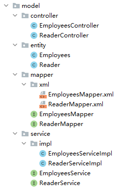
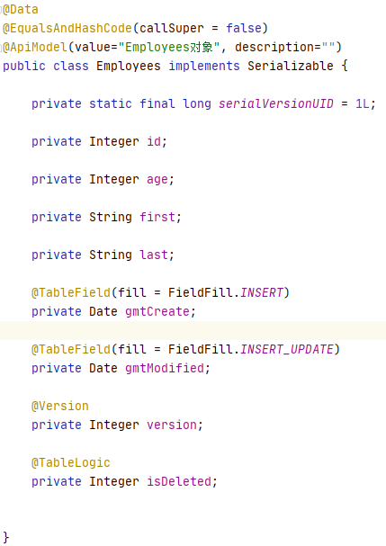

### AutoGenerator 介绍

AutoGenerator 是 MyBatis-Plus 的代码生成器，通过 AutoGenerator 可以快速生成 Entity、Mapper、Mapper XML、Service、Controller 等各个模块的代码，极大的提升了开发效率。

- 文档：https://baomidou.com/guide/generator.html
- 配置：https://baomidou.com/config/generator-config.html

<!--more-->

#### 依赖引入

```xml
<dependency>
    <groupId>com.baomidou</groupId>
    <artifactId>mybatis-plus-generator</artifactId>
    <version>3.4.1</version>
</dependency>
```

#### 模板引擎

MyBatis-Plus 支持 Velocity（默认）、Freemarker、Beetl，用户可以选择自己熟悉的模板引擎。

Velocity（默认）：

```xml
<dependency>
    <groupId>org.apache.velocity</groupId>
    <artifactId>velocity-engine-core</artifactId>
    <version>2.2</version>
</dependency>
```

Freemarker：

```xml
<dependency>
    <groupId>org.freemarker</groupId>
    <artifactId>freemarker</artifactId>
    <version>2.3.30</version>
</dependency>
```

Beetl：

```xml
<dependency>
    <groupId>com.ibeetl</groupId>
    <artifactId>beetl</artifactId>
    <version>3.3.1.RELEASE</version>
</dependency>
```

注意！如果您选择了非默认引擎，需要在 AutoGenerator 中 设置模板引擎。

```java
AutoGenerator generator = new AutoGenerator();
// set freemarker engine
generator.setTemplateEngine(new FreemarkerTemplateEngine());
```

### 自动生成代码

```java
import com.baomidou.mybatisplus.annotation.DbType;
import com.baomidou.mybatisplus.annotation.FieldFill;
import com.baomidou.mybatisplus.annotation.IdType;
import com.baomidou.mybatisplus.generator.AutoGenerator;
import com.baomidou.mybatisplus.generator.config.DataSourceConfig;
import com.baomidou.mybatisplus.generator.config.GlobalConfig;
import com.baomidou.mybatisplus.generator.config.PackageConfig;
import com.baomidou.mybatisplus.generator.config.StrategyConfig;
import com.baomidou.mybatisplus.generator.config.po.TableFill;
import com.baomidou.mybatisplus.generator.config.rules.DateType;
import com.baomidou.mybatisplus.generator.config.rules.NamingStrategy;
import com.baomidou.mybatisplus.generator.engine.FreemarkerTemplateEngine;

import java.util.ArrayList;

public class GenerateCode {

    public static void main(String[] args) {
        // 需要构建一个 代码自动生成器 对象
        AutoGenerator mpg = new AutoGenerator();
        mpg.setTemplateEngine(new FreemarkerTemplateEngine()); // 添加 Freemarker 模板引擎
        // 配置策略
        // 1、全局配置
        GlobalConfig gc = new GlobalConfig();
        String projectPath = System.getProperty("user.dir");
        gc.setOutputDir(projectPath+"/src/main/java");
        gc.setAuthor("Jue");//作者名称
        gc.setOpen(false);
        gc.setFileOverride(false); // 是否覆盖
        gc.setIdType(IdType.ID_WORKER);
        gc.setDateType(DateType.ONLY_DATE);
        gc.setSwagger2(true);//实体属性 Swagger2 注解

        // 自定义文件命名，注意 %s 会自动填充表实体属性！
        gc.setServiceName("%sService");
        gc.setControllerName("%sController");
        gc.setServiceName("%sService");
        gc.setServiceImplName("%sServiceImpl");
        gc.setMapperName("%sMapper");
        gc.setXmlName("%sMapper");

        mpg.setGlobalConfig(gc);

        //2、设置数据源
        DataSourceConfig dsc = new DataSourceConfig();
        dsc.setUrl("jdbc:mysql://localhost:3306/test?useSSL=false&useUnicode=true&characterEncoding=utf-8&serverTimezone=GMT%2B8");
        dsc.setDriverName("com.mysql.cj.jdbc.Driver");
        // dsc.setDriverName("com.mysql.jdbc.Driver"); //mysql5.6以下的驱动
        dsc.setUsername("root");
        dsc.setPassword("jue");
        dsc.setDbType(DbType.MYSQL);
        mpg.setDataSource(dsc);
        //3、包的配置
        PackageConfig pc = new PackageConfig();
        pc.setParent("com.jueee.generator"); //包名
        pc.setModuleName("model"); //模块名
        pc.setEntity("entity");
        pc.setMapper("mapper");
        pc.setService("service");
        pc.setController("controller");
        mpg.setPackageInfo(pc);

        //4、策略配置
        StrategyConfig strategy = new StrategyConfig();
        strategy.setInclude("employees","reader"); // 设置要映射的表名
        strategy.setNaming(NamingStrategy.underline_to_camel);
        strategy.setColumnNaming(NamingStrategy.underline_to_camel);
        strategy.setEntityLombokModel(true); // 自动lombok；
        strategy.setLogicDeleteFieldName("is_deleted");
        // 自动填充配置
        TableFill gmtCreate = new TableFill("gmt_create", FieldFill.INSERT);
        TableFill gmtModified = new TableFill("gmt_modified",FieldFill.INSERT_UPDATE);
        ArrayList<TableFill> tableFills = new ArrayList<>();
        tableFills.add(gmtCreate);
        tableFills.add(gmtModified);
        strategy.setTableFillList(tableFills);
        // 乐观锁
        strategy.setVersionFieldName("version");
        //根据你的表名来建对应的类名，如果你的表名没有下划线，比如test，那么你就可以取消这一步
        strategy.setTablePrefix("t_");
        strategy.setRestControllerStyle(true); //rest请求
        //自动转下划线，比如localhost:8080/hello_id_2
        strategy.setControllerMappingHyphenStyle(true);
        mpg.setStrategy(strategy);
        mpg.execute(); //执行
    }
}
```

效果如下：



以 Bean 中的 `Employees` 为例，效果如下：

