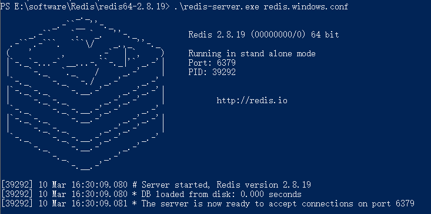
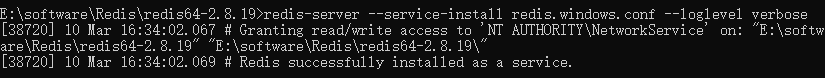
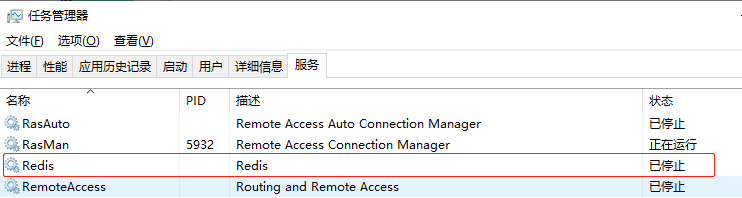

### 下载Windows版本的Redis

原来在官网上可以下载的windows版本的，现在官网以及没有下载地址，只能在github上下载，官网只提供linux版本的下载。

官网下载地址：http://redis.io/download

github下载地址：https://github.com/MSOpenTech/redis/tags

<!--more-->

### 安装Redis

下载后，解压 Redis 即可。

启动命令 `redis-server redis.windows.conf`，出现下图显示表示启动成功了。



### 设置Redis服务

上面虽然启动了Redis，但是只要一关闭cmd窗口，Redis就会消失。所以要把Redis设置成windows下的服务。

设置服务命令如下：

```
redis-server --service-install redis.windows.conf --loglevel verbose
```



输入命令之后没有报错，表示成功了，刷新服务，会看到多了一个redis服务。



### 常用的Redis服务命令

卸载服务：redis-server --service-uninstall

开启服务：redis-server --service-start

停止服务：redis-server --service-stop

### 启动失败异常处理

#### 配置日志路径

修改 `redis.windows.conf` 文件：

```conf
# Specify the log file name. Also 'stdout' can be used to force
# Redis to log on the standard output. 
logfile "logs/redis.log"
```

并手动创建 logs 日志目录。

从而可以查看失败日志。

#### bind: No error

启动报错：

```
Creating Server TCP listening socket 127.0.0.1:6379: bind: No error
```

可以尝试更换端口，再次进行启动。

