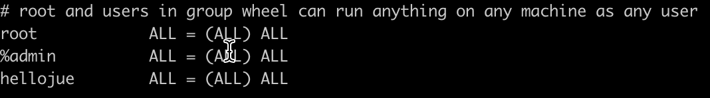

整理汇总 MacBook 的特殊操作。

<!--more-->

### 用户终端 sudo 免密码

1.    打开终端

2.    输入 `sudo visudo`

3.    输入 i 进入insert模式， 翻到最下面找到配置用户和组的位置，如下图：

4.    切换到root用户 `sudo su root`
5.    切换到自己的用户 `sudo su 你的用户名`
6.    重启终端生效

### 

