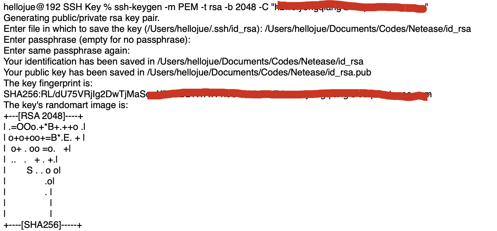
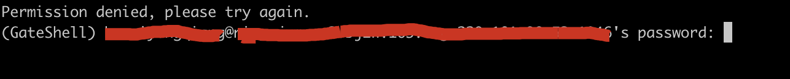
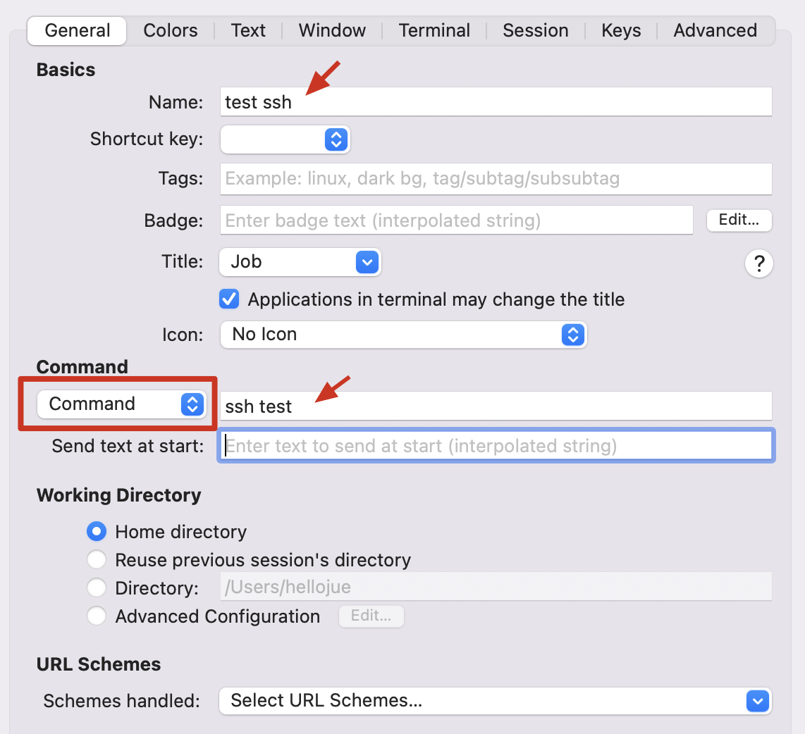

### 生成密钥

通过如下命令生成密钥：

```
ssh-keygen -m PEM -t rsa -b 2048 -C "jueee"
# -t rsa        表示生成RSA类型的KEY
# -b 2048       表示生成的KEY长度为2048位
# -C "jueee"    表示作为生成KEY的注释
# -m PEM        force ssh-keygen to export as PEM format 
```

如下所示：



### 上传密钥

将公钥上传到服务器。

将私钥通过 `ssh-add -K .ssh/id_rsa` 添加进 Mac 本身的钥匙串。

### ssh 命令行

可以通过如下命令行测试链接：

```
ssh -p 1046 jueee@xxx.xxx.com -i 20220723-id_rsa -A
```

其中，`-A` 选项表示启用 agent-forwding。 

### ssh配置

1. ssh配置
   **.ssh/config**
   
   ```
   Host test
   Hostname xxx.xxx.com        #堡垒机域名  
   User jueee                  #登入堡垒机用户名,修改为自己的名称
   port 22                     #登入堡垒机端口
   ForwardAgent yes            #key转发
   # IdentityFile ~/.ssh/20220723-id_rsa
   #######如果复制该配置，请把#相关的注释拿掉
   ```

2. 将私钥添加进 Mac 本身的钥匙串，执行 ssh-add -K privateKey
   
   ```
   ssh-add -K ~/.ssh/id_rsa          #将私钥添加进 Mac 本身的钥匙串
   # 注意：windows WSL或其他linux终端使用 ssh-agent bash
   ```

3. 查看确认钥匙串，执行 `ssh-add -l`。

4. ssh登入堡垒机，执行 `ssh test`

### 问题处理

如果出现如下 **Permission denied, please try again.** 异常：



1. 在.ssh/config文件中加入：ForwardAgent yes

2. （**重启过电脑**）先确认是否已经将私钥加载到ssh-agent缓存中(命令：ssh-add -l )，如果未加载密钥出现 The agent has no identities ，并使用命令加载：ssh-add .ssh/id_rsa

3. 如果还是无法解决问题，请试图将.ssh/known_hosts文件中有关堡垒机配置的记录删除。

### iterm2配置

打开 item2 的 Profiles-> Open Profiles：


通过 Edit Profiles 进行新增：



即可在 item2 的 Profiles 中进行选择打开。

### Mac 配置自动 ssh-add

mac机器需要每次开机ssh-add一遍私钥，实在是太麻烦，以前有个方法ssh-add -K privateKey 可以把私钥存到keychain中，重启后也不需要手动ssh-add，这个方法现在不行了。
