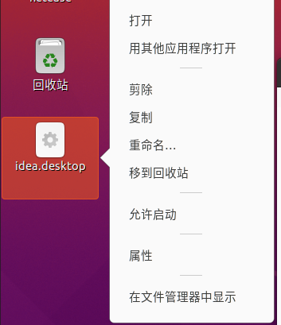

介绍在 Ubuntu下安装idea的方法并创建桌面快捷方式。

<!--more-->

### 安装 idea

打开idea 官网，点击下载：

> https://www.jetbrains.com/zh-cn/idea/

解压：`tar -zxvf ideaIU-2022.2.tar.gz`

移动：`mv idea-IC-222.3345.118/ /home/netease/文档/software/`

启动：到 idea 目录 bin 下执行 `./idea.sh` 。

### 创建快捷方式

每次启动的时候都需要到idea目录bin下执行：

```
./idea.sh
```

这样比较麻烦，现在我们在 **桌面** 上创建快捷方式。

1. 创建快捷方式。注意，必须要在桌面上创建快捷方式，才可生效。

   ```
   touch idea.desktop
   ```

2. 编辑此文件

   ```
   vi idea.desktop
   ```

3. 添加以下内容

   ```
   [Desktop Entry]
   Name=IntelliJ IDEA
   Comment=IntelliJ IDEA
   Exec=/home/netease/文档/software/idea-IC-222.3345.118/bin/idea.sh
   Icon=/home/netease/文档/software/idea-IC-222.3345.118/bin/idea.png
   Terminal=false
   Type=Application
   Categories=Developer;
   ```

4. 此时，图标如下：
   

5. 鼠标右键，设置允许启动：
   

6. 此时，图标会变成 idea 的图标。如下所示：
   

7. 然后双击该 idea 图标，即可打开 idea 软件了。


