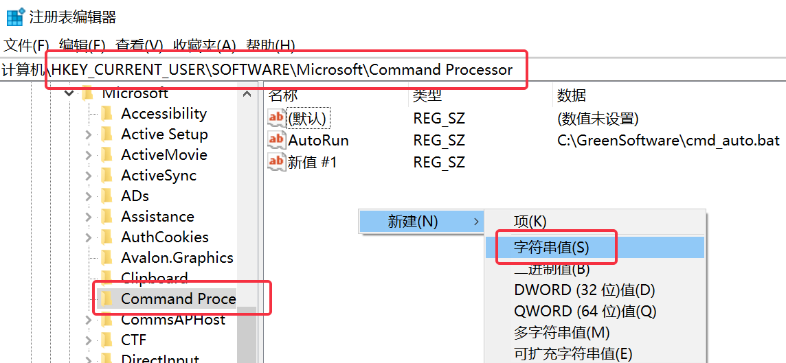
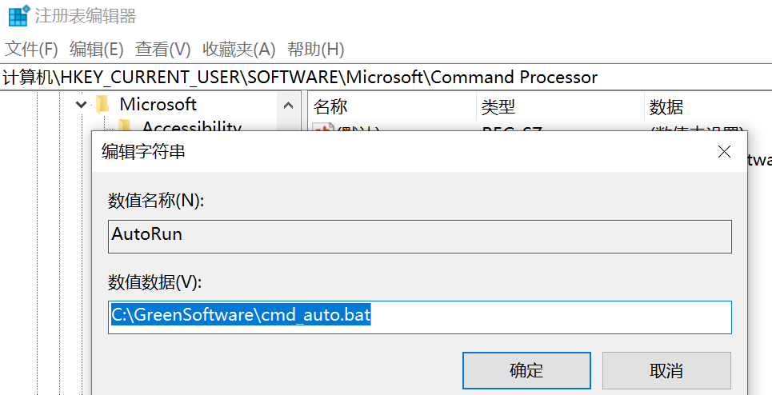
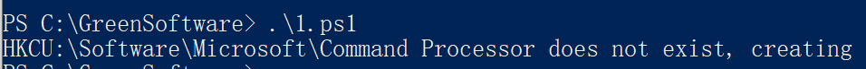

### doskey

doskey 相当于Linux中的alias，等号左边是右边的别名。
$* 表示这个命令还可能有其他参数。

但是doskey只在本次命令行中生效。如果想要在cmd持续生效，可以先将所需的别名保存一份bat。

<!--more-->

### 设置系统别名步骤

#### 新建 bat 文件

在某个目录下（建议在用户根目录）新建文件cmd_auto.bat , 输入自己需要的常用命令的别名。

下面是我的cmd_auto.bat：

```bat
@echo off
doskey ls=dir /b $*
doskey alias=doskey /macros
doskey history=doskey /history
doskey mvnci=mvn clean install -Dmaven.test.skip=true
doskey mvncp=mvn clean package -Dmaven.test.skip=true
```

#### 修改注册表

使cmd启动时自动执行该bat文件。
win+r，键入`regedit`，进入地址：`计算机\HKEY_CURRENT_USER\Software\Microsoft\Command Processor`

右边空白处右键新建->字符串值。



双击编辑该值，随便起个名字（比如AutoRun），数值数据里填刚才新建的bat文件的路径（我的是C:\GreenSoftware\cmd_auto.bat）



#### 别名生效

确定后重启cmd，别名就可以用了

```
$ alias
ls=dir /b $*
mvnci=mvn clean install -Dmaven.test.skip=true
alias=doskey /macros
mvncp=mvn clean package -Dmaven.test.skip=true
history=doskey /history
```

### 注册表中找不到配置

部分机器存在注册表中找不到Command Processor的问题。

路径地址：`计算机\HKEY_CURRENT_USER\Software\Microsoft\Command Processor`

此时，可以自己添加一个，把下面代码写到1.ps1：

```ps1
$regPath = 'HKCU:\Software\Microsoft\Command Processor'

if (! (test-path $regPath) ) {
   write-output "$regPath does not exist, creating"
   $eatMe = new-item -path $regPath
}
```

然后执行：



然后刷新注册表，就可以看到路径地址了，可以进行上面的别名配置。
