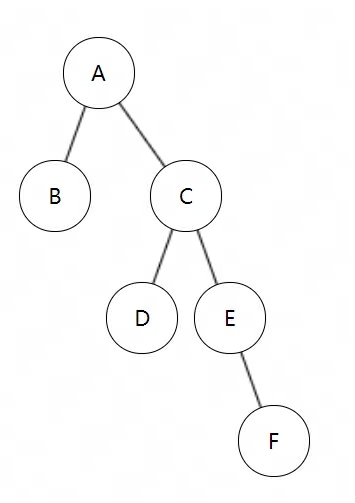
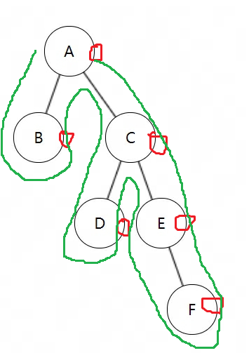

### 根据二叉树的前序中序遍历结果，求后序遍历结果

当一棵二叉树的前序序列和中序序列分别是ABCDEF和BADCEF时，其后序序列必是？

- 前序序列：ABCDEF，依次在表格左侧顺序写入列
- 中序序列：BADCEF，依次在表格下侧顺序写入行
- 交叉的节点，即为二叉树的节点

| A    |      | A    |      |      |      |      |
| ---- | ---- | ---- | ---- | ---- | ---- | ---- |
| B    | B    |      |      |      |      |      |
| C    |      |      |      | C    |      |      |
| D    |      |      | D    |      |      |      |
| E    |      |      |      |      | E    |      |
| F    |      |      |      |      |      | F    |
|      | B    | A    | D    | C    | E    | F    |

二叉树的结果为：

在每个节点的后侧画个节点，依次遍历二叉树，即可得到其后序遍历结果：

则其后续遍历是：BDFECA

二叉树：[A,B,C,null,null,D,E,null,null,null,F]

绘制树：https://blog.schwarzeni.com/works/leetcode-binarytree-edit/
